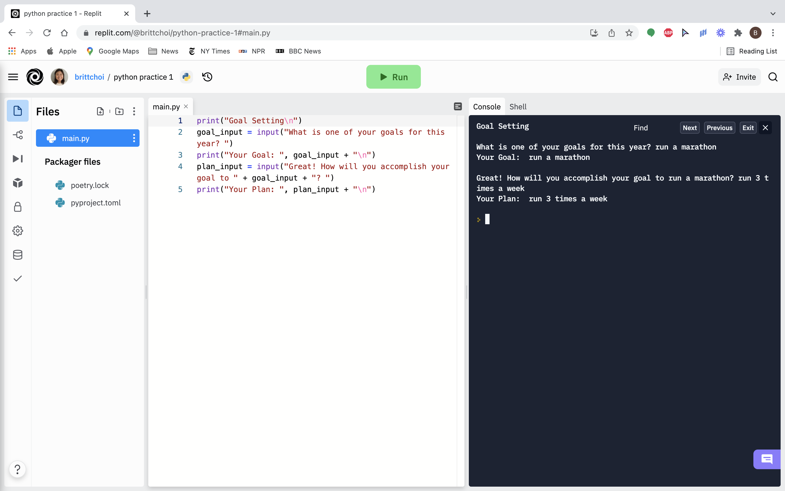
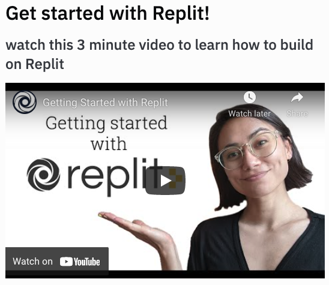
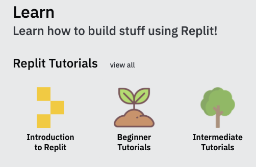

Hello! I’m Brittany Choi. A little bit about me: I was an English teacher, but I recently transitioned to Technical and Content Writing. I started learning how to code on Replit to gain technical skills and to learn something new.

*My first lines of code:*

I’ve compiled a list of the top 10 helpful resources for beginner coders or new Replit users. I’ve selected a variety of different types of resources for learners of all different styles because everyone learns and processes differently!

## Resource List
1. Video: [Getting Started with Replit](https://www.youtube.com/watch?v=Oqix86COhc4&feature=emb_logo)

*Check this out if: You’ve never used Replit before and want to become familiar with how to use it.*

First off, visit the Learn page on Replit. Click on the Replit Tutorial for a quick 3-minute video on how to navigate and get started with Replit. The video also shows you how to make your first repl and how to invite collaborators.  

2. Video: [Python Code Along by Maya Bello] (https://www.youtube.com/watch?v=bF_xdxYN-zw&t=147s)

*Check this out if: You’ve never coded in Python before and want to learn the basics.*

I used this video for my first day of learning how to code Python because I wanted to start with a programming language that is more friendly for beginners. Maya explains concepts in a way that is easy to understand. You can follow along by practicing on Replit to apply the concepts in the video.     

3. Replit [Teaching Curriculum](../images/10-resources-for-beginners/https://docs.replit.com/teaching-curriculum/intro-teaching-curriculum)

*Check this out if: You want to follow along lessons on your own.* 

The Teaching Curriculum on Replit’s site is a helpful tool. You can access complete lessons in the form of Google slides, and explanations in lesson plans and videos, all created by a Computer Science educator. It makes you feel like you are enrolled in class learning through examples and exercises you can try for yourself. 

4. Replit Docs: [Beginner and Intermediate Tutorials](https://docs.replit.com/tutorials/00-overview#part1)
  

*Check this out if: You like to read and follow along with written lessons.*

Follow the series of lessons with in-depth explanations and visual aids, starting with an introduction to Replit in the Beginner Tutorials and leading to building your own projects in the Intermediate Tutorials. 

5. Replit Docs: [Build the Snake Game with Kaboom.js](https://docs.replit.com/tutorials/21-build-snake-with-kaboom)

*Check this out if: You’re ready to start making games and want to build a Snake Game!*

You’ve played the popular Snake Game before, so why not try creating it? Once you’re ready for the Intermediate Tutorials, this is a fun project you can learn to make.

6. Video: [How to Build a Snake Game with Kaboom.js on Replit](https://www.youtube.com/watch?v=IG9WPc9-Qio)

*Check this out if: You prefer following along in video format instead.*

7. Video: [Creating a Game with Kaboom.js](../images/10-resources-for-beginners/https://www.youtube.com/watch?v=hgReGsh5xVU)

*Check this out if: You know some JavaScript, and now you’d like to learn how to create a fun game.*

If you know some JavaScript, you can follow along with this video to create your own flappy bird game with Kaboom.js in under 40 minutes. It’s great for beginners because the explanations are very clear and you can follow along step-by-step while creating your project. 

8. Video: [7 Features on Replit You Might Not Know About](https://www.youtube.com/watch?v=8QbW-2mGeyE)

*Check this out if: You want to be more efficient in your coding and learn about some helpful features on Replit.* 

This is a beneficial video to help learn how to navigate coding and special features on Replit better. 

9. Curriculum: [Project Based Learning](https://replit.com/curriculum/Python-Project-Based-Learning)

*Check this out if: You enjoy learning through creating your own projects.*

Using this teacher-created curriculum, you can select a unit to complete various exercises and projects. There are clear directions for each exercise and project for you to follow along with. 

10. Video: [Getting Started with Python on Replit - Tips, Tricks and Examples](https://www.youtube.com/watch?v=VGiCFnyTRRk&t=335s)

*Check this out if: You are already familiar with Python and want some additional tips.*

After learning some background in Python, this is a helpful video to learn some tips and tricks for coding in Python on Replit. It will aid you in creating projects faster and more efficiently. 

## Learning from Other Projects

Another underrated, yet highly valuable resource: other projects on Replit! You can learn a lot from reading and forking the code from other projects people have created on Replit. Plus, it’s cool to see what creative games and projects people from the Replit community create. 

I hope these resources are helpful for you as you begin your coding journey on Replit!
