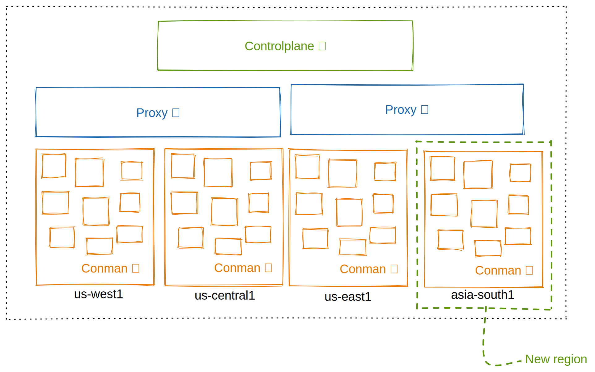
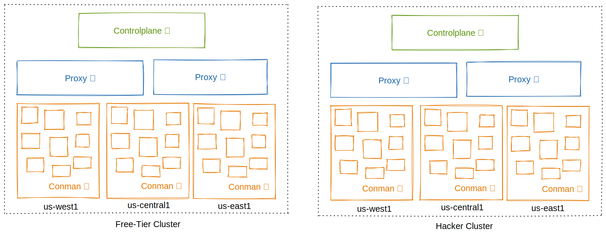

At Replit, we operate a cloud-based infrastructure that allows developers to collaborate and create within an all-in-one, integrated development environment. One of the most significant parts of this experience is the latency perceived by the developer when interacting with the workspace. While we can always [add resources such as CPU, RAM, and storage on demand](https://docs.replit.com/power-ups/boosts), when tackling latency we have to deal with some fundamental physical limits such as the speed of light. This means that you can only do so much for latency by throwing resources at it, and at some point, you just need to bring the server closer to the end user. Given that we want to provide a platform for the next billion software creators, that means that we need to have infrastructure distributed around the world.

While we run many of the workspace interactions, such as file editing and browsing, locally on the user's browser, many tasks still depend on communicating with your Repl running on our servers. Examples of such interactions are typing into the shell and getting [Language Server Protocol](https://microsoft.github.io/language-server-protocol/) results like catching errors and finding symbol definitions. Because these interactions require communication between the user's browser and the Repl, the only way to reduce latency is to bring the two closer together. In doing that, we also ensure that each bit of the development feedback loop remains quick and efficient, improving the experience for the user.

Replit's platform team works hard on improving the infrastructure at the core of Replit. This includes running containers, providing hosting, managing storage, and networking. We recently made some substantial improvements to the infrastructure: dividing our infrastructure into multiple failure domains with [clusters](https://blog.replit.com/welcome-to-the-wonderful-world-of-clusters), moving our global state management from Redis to an SQL-backed [Control Plane](https://blog.replit.com/geo-part-1-controlplane), and creating our own [load balancer](https://blog.replit.com/geo-part-2-loadbalancing) for assigning Repls to machines. These improvements not only improve performance or minimize the surface for inconsistent states to show up, but at the end of the day, they provide an all-around superior experience to the developers on our platform. In this post, we'll give an overview of how Replit's infrastructure is organized, and then dive into detail about how we tackled the next step in improving the experience for a large number of developers: geographic distribution.

## Clusters: Isolation and Ease of Management

The infrastructure that runs Repls is broken into [clusters](https://blog.replit.com/welcome-to-the-wonderful-world-of-clusters). One important characteristic of clusters is that they are mostly isolated from each other. This means that we can manage pieces of our infrastructure separately, and it also allows us to delimit discrete [failure domains](https://en.wikipedia.org/wiki/Failure_domain). This means that, instead of affecting all users, outages and transient instabilities only affect a section of them. Partitioning users and, as a result, Repls between clusters, proved to be an important primitive that allowed us to break apart our infrastructure into pieces that can be deployed and managed in an isolated manner.
Clusters turned out to be a huge success in terms of partitioning out infrastructure into discrete failure domains and providing a better experience for developers as the number of Repls grew.

We expected the notion of clusters to be easily extended to support geographic replication. We did not impose a regional constraint on clusters, meaning that each cluster was spread out across multiple regions. For instance, for the free-tier cluster, we had pieces of the infrastructure running in `us-central1`, `us-east1`, and so forth. Ditto for all the other clusters. We architected our infrastructure so that, in theory, it doesn't matter which piece of infrastructure is running on which region, so that we don't have to worry about where a Repl is stored or in which machine a Repl is run when launched. This means that adding machines in regions outside the US should be easy right?

## Our First Attempt at Geographic Distribution

Our first attempt at creating a geographically distributed infrastructure was done by creating regional instances of each cluster in different locations around the world. So if we had `hacker-us-east1`, we could easily add, for instance, `hacker-asia-south1`. We took a stab at it and implemented this for internal testing. The results were not good, however.

We added conman machines for running Repls (containers) in the `asia-south1` GCP (Google Cloud Platform) region. This means that the actual piece of infrastructure with which developers directly interact will be closer to them. However, other pieces of the infrastructure were still located in the North American continent. 

A quick primer on how connections between developers and Repls are handled. We start off with some information exchange between the user's browser and our web server in order to mint a token. After this initial negotiation, the user's browser hits a certain endpoint handled by the GCP load balancer. The load balancer then picks some conman machine for your Repl to run in. At this point, we initiate a [WebSocket](https://en.wikipedia.org/wiki/WebSocket) connection between the user and the machine running the Repl's container. Note that this connection persists throughout the entire duration of the session.

Turns out that while GCP's load balancer works well for request-response style applications, it didn't work great for applications relying on long-lived WebSocket connections. One key issue with the geographic distribution approach we initially chose had to do with the _spillover_ feature of the load balancer. Spillover is when a certain region's backend is out of capacity so GCP's load-balancer diverts traffic to another backend in a different region. This meant that users could end up with severely suboptimal connections.

Another issue came with the way we handle multiplayer interactions. In our architecture, traffic can hop across multiple machines before reaching the machine on which the Repl is actually running. The way we did this at the time relied heavily on the behavior of the default Google Cloud Load Balancer, so this was mostly out of our control. There were cases where traffic hopped from the US to Asia, and back to the US again on almost every interaction. This could be addressed by implementing some sort of regional affinity in our load balancer, but other problems soon surfaced.

All of our databases and brains (Redis, then [Control Plane](https://blog.replit.com/geo-part-1-controlplane)) were only in the US. This adds extra latency for managing the global state of the infrastructure, which is definitely something you want to avoid. Another point was that the actual contents of the Repls (for example, text files containing your code) were still stored in the US, so transmitting that halfway across the world took a long time. This meant that startup time was terrible.

It was clear that we had to review our geographic distribution plan. How can we keep the benefits provided by clusters while adding the possibility of running Repls closer to wherever the user is?

## Clusters Revisited: The Resharded Architecture

Having multiple clusters worked great for separating failure domains and providing a better experience for developers. Due to the fact that most users ended up in the free-tier cluster, however, made it so that we had one cluster that was way too large for its own good. There was also the issue of designating users to individual clusters: having problems in a cluster means that some users won't be able to use Replit at all! It was time to rethink how clusters fit into the architecture.

Up until this point, in most situations, a user is taken to belong to a specific cluster. What if, instead, we made clusters look the same so that we can distribute Repls uniformly among them? This should result in a situation where the load is more equally distributed, and the overall experience is superior due to the fact that we're working with smaller units. It also opens the possibility of making these small, entirely self-contained units belong to just a single region, instead of being distributed among multiple regions.

So we ended up with a new organization, in which each user belongs to a **geographic region**, and each such region has multiple *shards* (to be used interchangeably with *clusters*) which have the same behavior and characteristics. The next question is: how to distribute Repls among the different shards in a region?

One alternative would be just to pick a random shard for each Repl. This would work but then you can't deterministically say what shard a Repl belongs to. Another alternative would be to take the Repl ID modulo the number of shards and pick a shard based on that. The problem with that approach is that, whenever you add a new shard, you end up with a large number of Repls needing to be moved across different shards. This is not a good property to have, since we want to minimize the costs of adding and removing new shards.

The solution is to use [**consistent hashing**](https://en.wikipedia.org/wiki/Consistent_hashing), which is a general technique that aims to minimize the number of items reassigned to a node whenever the number of nodes changes. It works roughly by distributing nodes (in our case, shards) along a circle, placing items (in our case, Repls) in that circle, then assigning each item to whatever node is closest to it in a clockwise direction. In doing that, whenever we add a new shard to a continent, we minimize the number of Repls that need to be transferred.

Having the technical details at hand, we decided that the new India region provided an excellent opportunity to test out the new architecture.

## Sculpting the Clouds Halfway Across the World

[India accounts for our second largest developer base](https://blog.replit.com/India%20Part%202). Since all Repls have been running exclusively in the United States, this has caused certain interactions to experience excessive latency for a significant portion of our user base. This can be especially disruptive when working with highly interactive experiences, such as LSP autocompletion and VNC. We decided to dedicate resources to improving the experience for developers in India.

At Replit, we create and manage our infrastructure using Terraform. This means that we instantly have automation on many of the critical steps to create all the resources needed for a cluster by moving some code and changing a few parameters. After reworking our code to make it more amenable for reuse (and also enforcing some [best practices](https://cloud.google.com/docs/terraform/best-practices-for-terraform)), we were able to get two clusters running in the `asia-south1` region. 

After the initial round of internal tests, we let users try the new Asia clusters by selecting their continent. When a user selects their continent, we transfer their Repls to the desired continent in the background. After a week we had about 3000 developers in the new clusters, and the results were promising.

## The Great User Migration

Based on analytics data, we estimated that about 20% of our users might benefit from running their Repls in Asia. That's no small amount, especially given the fact that we recently reached [20 million developers](https://blog.replit.com/20-million-developers), each with many Repls on average. We decided to initially transfer a batch of over 300,000 users from India. This is not just a matter of setting a value in the database and calling it a day - let's go over the details of the migration while taking a brief detour to explain how Repls are transferred across clusters.

## Cluster Transfers

Since clusters are isolated from each other, we have some source of truth that knows which cluster Repls belong to. This is the job of the cluster-tracking service. This service also plays a large role in our [custom DNS infrastructure](https://blog.replit.com/dns). A notable point is that this service is a critical piece of our infrastructure - if it goes down, users won't be able to access their Repls. Naturally, the cluster tracker is also responsible for transferring Repls across clusters. This means transferring the Repl's data and assigning it to the correct cluster in the database.

Now, transferring Repls in large amounts is no trivial task, especially since there's a critical piece of infrastructure sitting in that path, and also because in this case, we have to transfer to data centers halfway across the world. The trick here is to transfer Repls *lazily*. Instead of going through each of the user's Repls and transferring its data to another region upfront, we set a flag in the database that tells Lore to transfer the Repl whenever the user connects to it.

We went ahead and migrated over 300,000 users to the new Asia clusters by lazy transferring their Repls. Doing the Repl transfers lazily worked wonders to reduce the total amount of work that needed to be done, while also spreading it out to a longer time window. Not only have we avoided doing the unnecessary work of transferring potentially millions of unused Repls, we also did the migration with zero downtime for developers, without incurring too much load on our infrastructure.

## Conclusion

The graph below shows some measurements of interaction latency from the perspective of a user in India. The `NA` line shows the latency with the Repl running on our US servers. The `Asia` line, on the other hand, shows the latency when hitting our new Asia clusters. The difference is significant: India-US round trips took about 300ms on average. When using the `Asia` servers, by contrast, the average round trip time between the user and our servers was just *19ms*.

In conclusion, taking a step back and revising the approach we took to clusters made it possible to improve the experience for a large number of developers. You can now pick the location that's closest to you by simply accessing the `Account` page and choosing one of the available regions. Geographic distribution is something that we wanted to have for a long time now. None of this would be possible without the prior improvements to our infrastructure. Having powerful and battle-tested primitives allows you to carry out such projects with the confidence that you won't have outages or data corruption.

Happy Repling (with low latency)!