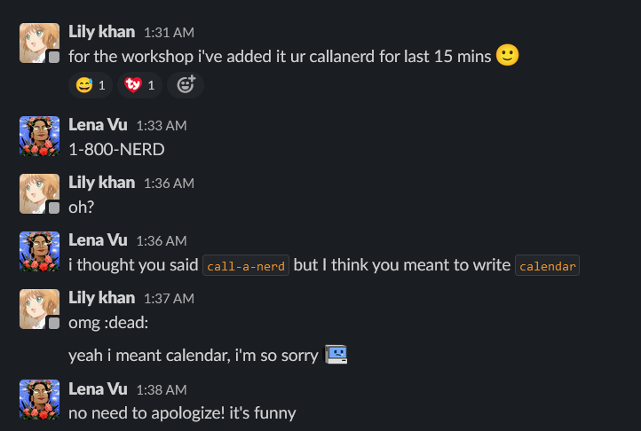

Hey, it’s your friendly community intern, [Lily](https://lilykhan.repl.co/)! It’s been 8 months since I became an intern at Replit, and this blog post concludes my awesome journey. 

### How did it all start?
I have been active in the Replit community for over 2 years where I used to primarily be a front-end developer and designer. I have participated in countless hackathons and community events, posted my design projects in the community, and much more. This made me kinda famous in the community! [Here](https://blog.lilykhan.repl.co/) is the post I wrote earlier on how I got into the Replit community. Back in 2020, after 4 months of being active, one of my friends (who was also a Replit team member back then) suggested that I apply for a design role. I, of course, really wanted to work at Replit, but I wasn't sure if I was ready. It took me more than a year to gather enough confidence to finally apply for the design role in November 2021! I also knew that Replit had eyes on me for a long time because of my contributions to the community and my performance in the hackathons.  

After a couple of weeks, I got an email from [Barron Webster](https://twitter.com/WarronBebster) (Design Lead at Replit) telling me that they hadn’t forgotten about my application. However, they had never had a Design Intern before, and they were currently working on finding the right way of bringing me in. I was told they would connect with me again at the start of 2022!

In January, I got a message from [Lena Vu](https://twitter.com/LenaAtReplit) (Community Lead) with an offer to join the Community Team at Replit. We discussed the possibilities for both Design and Community roles. I could start as a Community Intern right away, but for design, I would need to wait for the summer. I didn’t really want to wait that long, and also wanted to try something new, so, I chose to join Replit as a Community Intern, and started in January 2022!

### What happened during my internship?
During my time at the Replit, I worked on things like moderation, organizing and judging the [Template Jam](https://blog.replit.com/template-jam), the [#MadeWithReplit Hackathon](http://madewith.Replit.com), and many other community events. I also reached out to many influencers for collaboration like [Danny Thompson](https://twitter.com/DThompsonDev) and [Yuri Lee](https://twitter.com/codingyuri). I started a mentorship program for [Kajam](https://www.youtube.com/watch?v=Pt6dph3BPJM) (Replit's game dev hackathon) to help participants with their projects. Furthermore, I took down more than 1,000 toxic accounts from Replit while moderating the website in just the first 10 weeks of my internship!

I came up with many video ideas and helped edit some as well. For example, the [Without Replit](https://www.youtube.com/watch?v=XckwlrOtCrs]) video, where I interviewed many Replit community members and old interns. BTW, I'm also in that video 😛. I wrote some blog posts including my [Design Blog](https://blog.replit.com/design-blog), the [#MadewithReplit winners](https://blog.replit.com/mwr-winners) blog, the [Kajam winners blog](https://blog.replit.com/Kajam-winners22), and a few others. (I used to hate writing, but it's been fun!) I also helped collect and provide resources, write documentation, connect teams with community members, give community tours to our new interns, post content on our [Discord server](https://replit.com/discord), and more! I was active in so many projects that one of the members of my team, TheDrone7, would say, “Lily is everywhere!”

One of the biggest projects I helped organize was the [Replit India meet-up](https://twitter.com/Replit/status/1559034649749270528) which was a big success. It was the first IRL event I worked on. It was a meetup we had in Bengaluru, for interacting with our Indian community. It was also the first time when the Replit team and our community members actually got to see my face; I had worked with the team for over half a year but had never done a face reveal. Arnav, H (TheDrone7), and Sarv were also there from our team. 

Personally, I got a chance to fly for the very first time. I also got to meet some of my online friends IRL. Here is a behind the scenes video of the meet-up 

<blockquote class="twitter-tweet">
Behind the scenes of <a href="https://twitter.com/Replit?ref_src=twsrc%5Etfw">@Replit</a> India meet-up with Lily!! 💙🫡 <a href="https://t.co/poP70miMdY">pic.twitter.com/poP70miMdY</a>
&mdash; Lily ⠕ 💐 💻 (@LilyKhan786) <a href="https://twitter.com/LilyKhan786/status/1554489016950566917?ref_src=twsrc%5Etfw">August 2, 2022</a></blockquote> 

### People I would like to thank
[Lena](https://twitter.com/LenaAtReplit) for being the best mentor. [YK](https://twitter.com/ykdojo) and [David](https://twitter.com/LessonHacker) for being my brainstorming buddies! 
[Harmeet](https://twitter.com/TheDrone_7) and [Nathan](https://replit.com/@21natzil) for being awesome fellow community managers. Meghan and McKinley for being patient with me during my onboarding process. I would also like to thank [Jeff](https://twitter.com/Jeff_Burke14), [Brittany](https://twitter.com/brittany_replit), [Patrick](https://twitter.com/patrickscoleman), [Amjad](https://twitter.com/amasad), [Tala](https://twitter.com/_talaawwad), [Conner](https://twitter.com/ConnerSchafer), [Ornella](https://twitter.com/ornelladotcom), [Soren](https://twitter.com/roodsoren), [Derrick](https://twitter.com/demc_nyc), [Joe](https://www.instagram.com/bakedlab/), [Haya](https://twitter.com/HayaOdeh), [Faris](https://twitter.com/masadfrost), [Cecilia](https://twitter.com/CeciliaZin), [Arnav](https://twitter.com/itsarnavb), Phoenix, fellow interns and my friends for always supporting me and for answering all my questions!

### Why should you intern at Replit?
The Replit Team is simply amazing! It’s always okay to make mistakes and learn from them! Everyone is super kind and helpful! Working with such an amazing team and people was a dream come true.

Here is an example of me making a silly mistake and Lena being the best mentor:

At Replit, there’s always an opportunity to learn a wide variety of things. We have events like “FISH” (Friday Information Sharing and Hacking) where a team member teaches us about something they’re passionate about which is always fun. It actually happens on Wednesdays instead of Fridays though! 😛

Replit is inclusive of people from diverse cultures and timezones, and gives a lot of flexibility to the team! I’ve been moving a lot over the past few months and even though there is a huge difference in our timezones (more than 12 hours), I was still able to keep up with it. 

My days as an intern at Replit were always unique. My usual routine was working during the night, ending at around 4 am, watching some anime or YouTube, and then going to sleep. I wanted to try as many things as possible and Replit gave me the option to do that. Getting a taste of how work works at a company was new and the team made it so fun.  

If this sounds like something you'd enjoy, you should definitely consider applying to Replit. They also have a blog post on why you shouldn’t join Replit, though. You can [give it a read](https://blog.replit.com/reasons-not-to-join-replit#:~:text=There%20is%20no%20door%20to,more%20than%20okay%20with%20us!) before your decision.

### My future plans
What's next? Time to participate in more hackathons!?! 😃 Now that my internship is completed, I’m open to new opportunities for community or design roles. I’ve been thinking a lot about whether I should focus on sharpening my design skills or joining a community role to meet and connect with more people. I like designing but I really enjoy community management as well. I’m more interested in part-time or internship roles than full-time. Replit has been an amazing learning experience where I got to try loads of new things. I'll still be a part of Replit as a Replit Rep and will continue being active in the community!

Thank you so much for reading my blog!! („• ᴗ •„)	